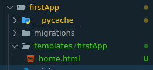

## Architecture


## Create Project

- created a vitual environment
- create a `.gitignore` file
- activate the environment:
    - windows: `.\env\Scripts\activate`
    - linux: `source env/bin/activate`
- install django: `pip install Django`
- add the `env` route(relative route) inside the `.gitignore`
- create a django-project: `django-admin startproject projectFarm`
- `cd` (change directory- helps you navigate inside a directory) into the `projectFarm`
- confirm your directory using either `dir` or `ls`, you should spot `manage.py` file
- run first django project: `python manage.py runserver` 

## Create App
- `python manage.py startapp firstApp`
- register the application in the main project:
    - navigate to project level settings.py:
        ```
        INSTALLED_APPS = [
            'django.contrib.admin',
            'django.contrib.auth',
            'django.contrib.contenttypes',
            'django.contrib.sessions',
            'django.contrib.messages',
            'django.contrib.staticfiles',
            'firstApp'
        ]
        ```

- add it to the path in the `project` level `urls.py`: 
    ```
        from django.contrib import admin
        from django.urls import path, include

        urlpatterns = [
            path('admin/', admin.site.urls),
            path('firstApp/',include('firstApp.urls'))
        ]
    ```
        

- create a `urls.py` inside the `firstApp` directory:
    ```
        from django.urls import path # helps us import the method path for our endpoints
        from . import views # import veiws from the current root directory

        # endpoints + target view functions
        urlpatterns = [
            path('produce', views.produceSector)
        ]
    ```

- run it once more

## Create a Model: 
- create model class for `produce`:
    ``` 
    class Produce(models.Model): # name of the table 
        name = models.CharField(max_length=200) # strings with a max length in character of 200
        description = models.CharField(max_length=255) # strings with a max length in character of 255
        price = models.FloatField() # float numbers eg 20.25
    
    ```
- make migrations: `python manage.py makemigrations`:
    

- run a migration: `python manage.py migrate`:
    

## Create SuperUser and accessed the admin panel
- create superuser `python manage.py createsuperuser`:
    
- run the app: `python manage.py runserver`
- navigate to `/admin` endpoint:
    

## Register the model in the admin panel
- navigate to the `admin.py`(in app directory/folder) and register the models
    ```
    from django.contrib import admin
    from . import models # models

    # Register your models here.

    admin.site.register(models.Produce)

    ```

- refresh your admin panel (assuming you are still runnning the project):
    

## Adding Templates
- navigate to the projct root folder i.e inside `projectFarm`
- create a subfolder inside it and call it `templates`
- navigate to `settings.py`(found inside the projectfolder) and add this configuration 
    ```
            TEMPLATES = [
                {
                    'BACKEND': 'django.template.backends.django.DjangoTemplates',
                    'DIRS': [BASE_DIR / 'templates'],
                    'APP_DIRS': True,
                    'OPTIONS': {
                        'context_processors': [
                            'django.template.context_processors.request',
                            'django.contrib.auth.context_processors.auth',
                            'django.contrib.messages.context_processors.messages',
                        ],
                    },
                },
            ]
    ```
- create a `main.html` file inside it: 
    ```
        <!DOCTYPE html>
        <html lang="en">

        <head>
            <meta charset="UTF-8">
            <meta name="viewport" content="width=device-width, initial-scale=1.0">
            <title>Document</title>
            <link href="https://cdn.jsdelivr.net/npm/bootstrap@5.3.8/dist/css/bootstrap.min.css" rel="stylesheet"
                integrity="sha384-sRIl4kxILFvY47J16cr9ZwB07vP4J8+LH7qKQnuqkuIAvNWLzeN8tE5YBujZqJLB" crossorigin="anonymous">
            <script defer src="https://cdn.jsdelivr.net/npm/bootstrap@5.3.8/dist/js/bootstrap.bundle.min.js"
                integrity="sha384-FKyoEForCGlyvwx9Hj09JcYn3nv7wiPVlz7YYwJrWVcXK/BmnVDxM+D2scQbITxI"
                crossorigin="anonymous"></script>

        </head>

        <body>
            <div class="container my-5">
                <div class="display-6"> Welcome Home </div>
            </div>
        </body>

        </html>
    ```
- updated the view funtion related to it: 
    ```
    # Create your views here.
        def produceSector(request): 
            return render(request, 'main.html')  
    ```
- we will now inherit templates using: 

    ```
    
    
    ```
- we will also create a container area for different pages: 
    ```
     
     
    ```
- now update your `main.html` as this: 
    ```
    <!DOCTYPE html>
    <html lang="en">

    <head>
        <meta charset="UTF-8">
        <meta name="viewport" content="width=device-width, initial-scale=1.0">
        <title>Document</title>
        <link href="https://cdn.jsdelivr.net/npm/bootstrap@5.3.8/dist/css/bootstrap.min.css" rel="stylesheet"
            integrity="sha384-sRIl4kxILFvY47J16cr9ZwB07vP4J8+LH7qKQnuqkuIAvNWLzeN8tE5YBujZqJLB" crossorigin="anonymous">
        <script defer src="https://cdn.jsdelivr.net/npm/bootstrap@5.3.8/dist/js/bootstrap.bundle.min.js"
            integrity="sha384-FKyoEForCGlyvwx9Hj09JcYn3nv7wiPVlz7YYwJrWVcXK/BmnVDxM+D2scQbITxI"
            crossorigin="anonymous"></script>

    </head>

    <body>

        

        
        
        
    </body>

    </html>
    ```
- create `home.html` inside the templates directory: 
    ```
    
    

    <div class="container my-5">
        <div class="display-6"> Welcome Home </div>
    </div>

    
    ```

- decouple the app related template:
    - create a subfolder called `templates` inside the app directory, i.e `templates`
    - create a subfolder inside templates  called `firstApp` (name of the application): 
    

- update your `views.py` file: 
    ```
    # Create your views here.
    def produceSector(request): 
        return render(request, 'firstApp/home.html')  
    ```

## Creating the routes in navbar
- adding the navbar
-  on the hrefs, place the routes as such:
    ``


## Display Data on Template