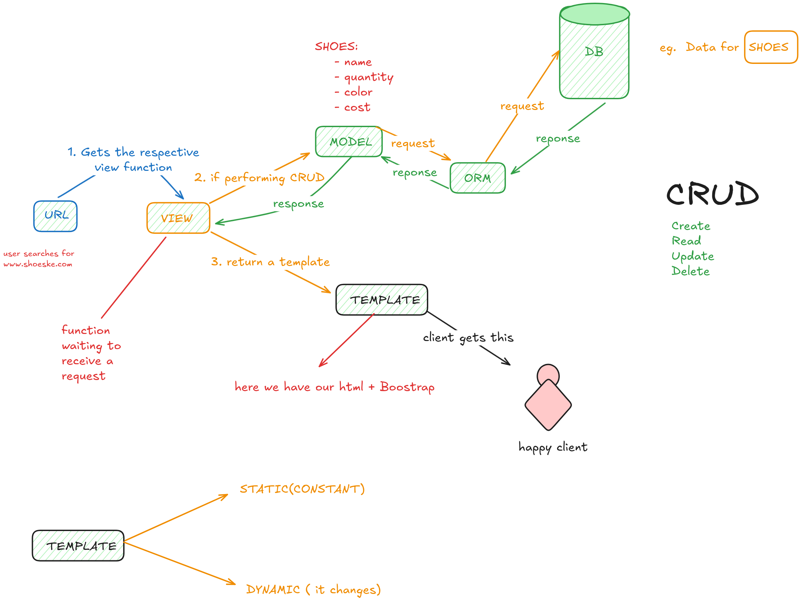
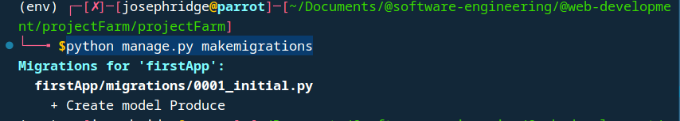
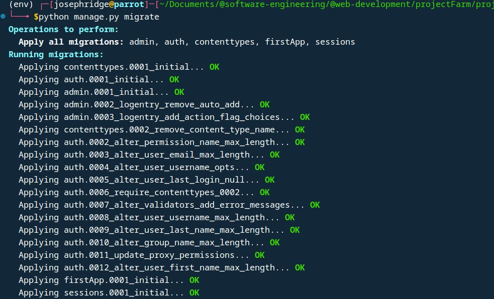
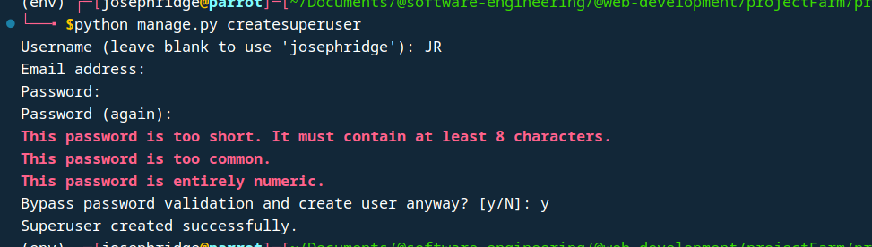
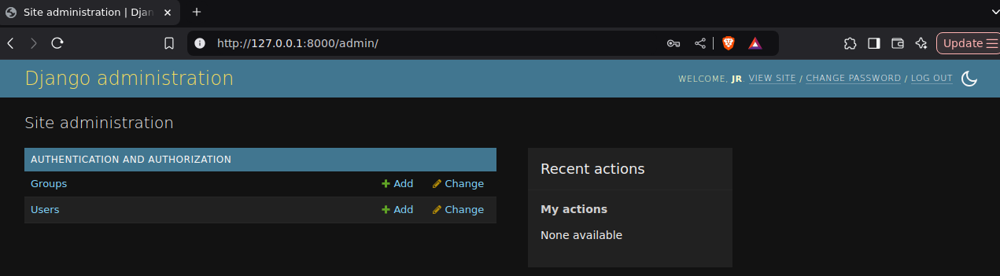
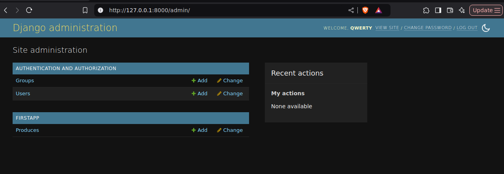

## Architecture


## Create Project

- created a vitual environment
- create a `.gitignore` file
- activate the environment:
    - windows: `.\env\Scripts\activate`
    - linux: `source env/bin/activate`
- install django: `pip install Django`
- add the `env` route(relative route) inside the `.gitignore`
- create a django-project: `django-admin startproject projectFarm`
- `cd` (change directory- helps you navigate inside a directory) into the `projectFarm`
- confirm your directory using either `dir` or `ls`, you should spot `manage.py` file
- run first django project: `python manage.py runserver` 

## Create App
- `python manage.py startapp firstApp`
- register the application in the main project:
    - navigate to project level settings.py:
        ```
        INSTALLED_APPS = [
            'django.contrib.admin',
            'django.contrib.auth',
            'django.contrib.contenttypes',
            'django.contrib.sessions',
            'django.contrib.messages',
            'django.contrib.staticfiles',
            'firstApp'
        ]
        ```

- add it to the path in the `project` level `urls.py`: 
        ```
        from django.contrib import admin
        from django.urls import path, include

        urlpatterns = [
            path('admin/', admin.site.urls),
            path('firstApp/',include('firstApp.urls'))
        ]
        ```

- create a `urls.py` inside the `firstApp` directory:
    ```
    from django.urls import path # helps us import the method path for our endpoints
        from . import views # import veiws from the current root directory

        # endpoints + target view functions
        urlpatterns = [
            path('produce', views.produceSector)
        ]
    ```

- run it once more

## Create a Model: 
- create model class for `produce`:
    ``` 
    class Produce(models.Model): # name of the table 
        name = models.CharField(max_length=200) # strings with a max length in character of 200
        description = models.CharField(max_length=255) # strings with a max length in character of 255
        price = models.FloatField() # float numbers eg 20.25
    
    ```
- make migrations: `python manage.py makemigrations`:
    

- run a migration: `python manage.py migrate`:
    

## Create Admin
- create superuser `python manage.py createsuperuser`:
    
- run the app: `python manage.py runserver`
- navigate to `/admin` endpoint:
    

## Register the model in the admin
- navigate to the `admin.py`(in app directory/folder) and register the models
    ```
    from django.contrib import admin
    from . import models # models

    # Register your models here.

    admin.site.register(models.Produce)

    ```

- refresh your admin panel (assuming you are still runnning the project):
    
